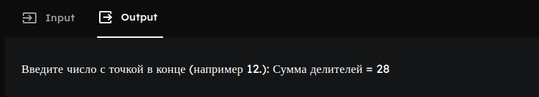
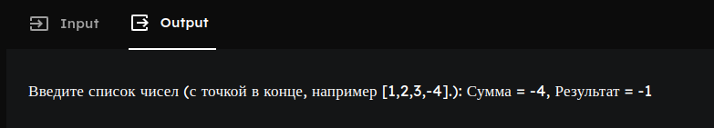

# Красных Александр ИТС-2 Лабораторная №5

# Задание 1

### Текст задачи

Найти сумму делителей данного натурального числа.

### Алгоритм решения

1. Нам понадобится несколько функций для определения и суммирования делителей.
2. Для начала заполним main, в нем мы спросим число для которого будем проверять
и суммировать делители. Там же мы вызовем функцию для старта этих операцийи
выведем пользователю результат.
3. Пишем следующий этап: рекурсию для проверки делителей.
4. sum_divisors с 2 параметрами будет вызывать рекурсивнию на функция sum_divisors
с 4 параметрами.
5. Для начала мы проверяем не вышли ли за пределы введенного числа, если истинно выход
из рекурсии, если ложно начинается вторая функция sum_divisors с 4 параметрами которая уже
проверяет делитель ли текущее число и проводит суммирование если истинно, а затем продолжает
рекурсию.
6. При срабатывании выхода из рекурсии результат суммирования выводим на экран

### Тестирование

# Задание 2

### Текст задачи

Если сумма элементов списка отрицательна, вывести –1, если положительна —
1, если равна нулю, то 0. 

### Алгоритм решения

1. 

### Тестирование

