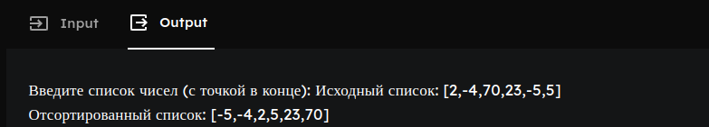

# Красных Александр ИТС-2 Лабораторная №5

# Задание 1

### Текст задачи

Найти сумму делителей данного натурального числа.

### Алгоритм решения

1. Нам понадобится несколько предикатов для определения и суммирования делителей.
2. Для начала заполним main, в нем мы спросим число для которого будем проверять
и суммировать делители. Там же мы вызовем предикат для старта этих операцийи
выведем пользователю результат.
3. Пишем следующий этап: рекурсию для проверки делителей.
4. sum_divisors с 2 параметрами будет вызывать рекурсию на предикате sum_divisors
с 4 параметрами.
5. Для начала мы проверяем не вышли ли за пределы введенного числа, если истинно выход
из рекурсии, если ложно начинается второй предикат sum_divisors с 4 параметрами который уже
проверяет делитель ли текущее число и проводит суммирование если истинно, а затем продолжает
рекурсию.
6. При срабатывании выхода из рекурсии результат суммирования выводим на экран

### Тестирование

# Задание 2

### Текст задачи

Если сумма элементов списка отрицательна, вывести –1, если положительна —
1, если равна нулю, то 0. 

### Алгоритм решения

1. Теперь мы работаем со списком. Запрашиваем его у пользователя.
2. Передаем список в предикат вычисляющий сумму элементов.
3. Возвращенное значение передаем в предикат по вычислению знака.
4. Выводим результат

### Тестирование

# Задание 3

### Текст задачи

Реализовать сортировку списка слиянием.

### Алгоритм решения

1. И вновь списки, запрашиваем.
2. Передаем исходный список в предикат сортировки слиянием.
3. Данный предикат вызывает свои дополнительные предикаты которые рубят список пополам
затем рекурсивно вызывает себя же для одной половины списка и для другой для сортировки.
4. Затем уже сорированные половинчатые списки сращиваются в 1 полностью отсортированный список.
5. Нам остается лишь вывести сей список на экран.

### Тестирование

